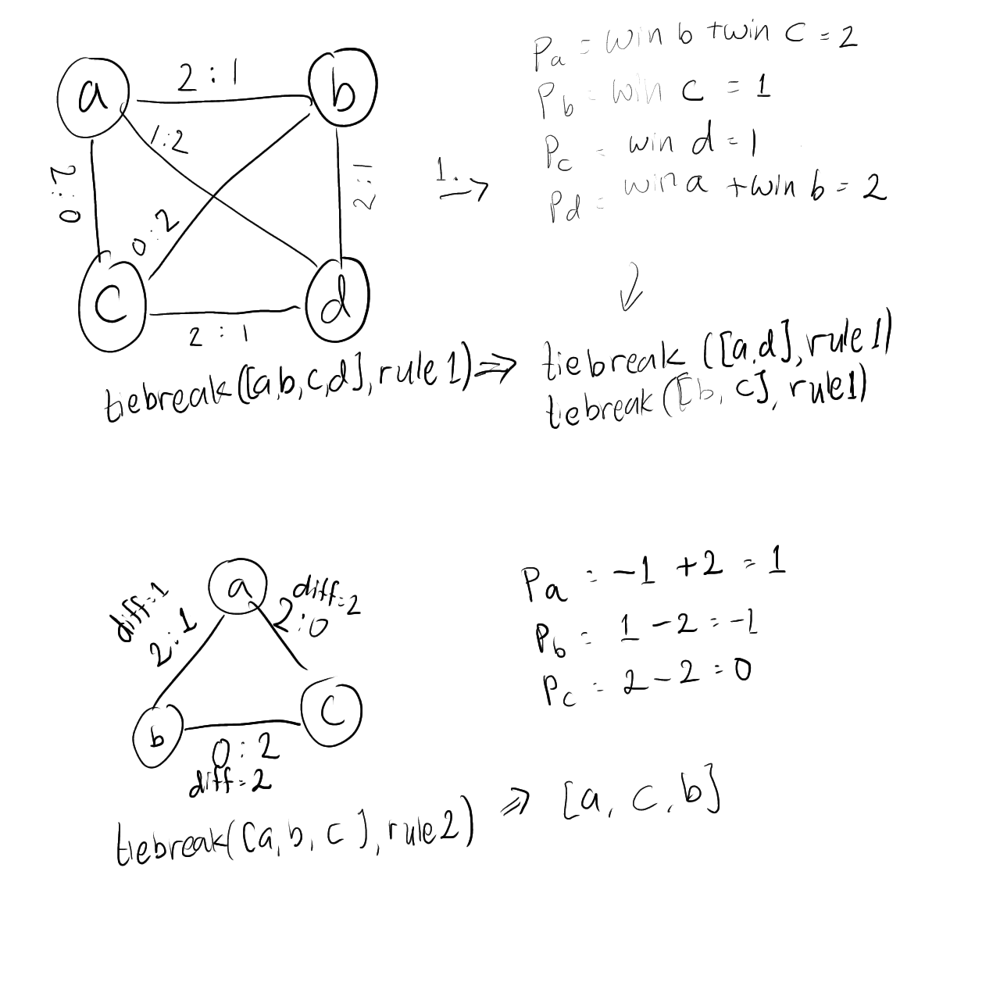

# Round-robin Tiebreaker

To use the app, consider using a linux distribution. If you are using Windows, it is encouraged for you to use a WSL.
First, install `python3`. Make sure `pyswip` and `pyeda` library is installed through pip.
Make sure `SWI-Prolog` is also installed in your OS.

To run the parser, you can use `python3 parse-pandascore.py ../data/epls15/raw/a.json ../data/epls15/d/3.json`. The parser takes 2 arguments, the input and output file. The input file is obtained from Pandascore API.


## Problem Description

The problem below is adapted from ESL Pro Tour of Counter Strike: Global Offensive Tournament group stage tiebreaking rules, as stated in https://cdn.eslgaming.com/misc/media/lo/ESL%20Pro%20Tour%20-%20CSGO%20Game%20Specific%20Rules.pdf. There are some predictions done by the fans to predict who will qualify from the group stage, and this inspires us to take this problem's solver as our group project https://twitter.com/StrikerHLTVorg/status/1505310228426166272, https://www.hltv.org/events/6137/esl-pro-league-season-15, which we think suits the logic paradigm programming.

This problem is based on a group stage tournament matching tiebreaking mechanism. Group stage is used to rank **n** teams, based on their performance. Define the teams are in set **S**, each **n** teams will compete against each other. In total, there will be **C(n, 2)** match conducted, (Best of 3 Rounds) between those **n** teams. For example, if there are **6** teams, then there will be **15** matches.

Each match consists of **at most 3 rounds**, in one match of team **x** and team **y**, there will be **4** possible results, define the results of those rounds won by x : y as:

- 2 : 1 (**x wins**, and gains 3 points in the group stage)
- 2 : 0 (**x wins**, and gains 3 points in the group stage)
- 0 : 2 (**y wins**, and gains 3 points in the group stage)
- 1 : 2 (**y wins**, and gains 3 points in the group stage)

The teams then will be sorted based on their total points gained from the group stage. But, a tie will happen on most of the case. So, a tiebreaking rules are needed. If a number of teams are tied by points at the end of a group stage, their ranking order will be decided as described below.

If after any point from **1. to 5.**, the number of tied teams is **reduced or divided into several groups of teams**, the still tied teams will in each case be compared again starting from the first point of the tiebreaking rules. Let's define a set **T** which contains **m** tied teams.

1. Points amassed between the tied teams (direct match win > direct match loss)
   - Each team's points will be recounted based only on the set **T**, not on the whole set **S**. Let's define a new score **p<sub>t</sub>** for a team **t** in **T**. **p<sub>t</sub> = sum of the points gained only from winning against other team in the set T** . The tied teams then will be sorted by the new score system **p**.
   - If another tie occurs, the tied teams will be separated and compared again starting from the first point of the tiebreaking rules.
2. Round difference between the tied teams (3:2 rounds > 3:3 rounds)
   - Each team's points will be recounted based only on the set **T**, not on the whole set **S**. Let's define a new score **p<sub>t</sub>** for a team **t** in **T**. **p<sub>t</sub> = sum of the round difference against other team in the set T**. Pay attention that a team will get negative score if the match is a lost for them, and will get positive score if the match is a win for them, with the amount of score is the round difference between each team. The tied teams then will be sorted by the new score system **p**.
   - If another tie occurs, the tied teams will be separated and compared again starting from the first point of the tiebreaking rules.
3. Number of round wins between the tied teams (3:3 rounds > 2:2 rounds)
   - This will rarely happen, each team's points will be recounted based only on the set **T**, not on the whole set **S**. Let's define a new score **p<sub>t</sub>** for a team **t** in **T**. **p<sub>t</sub> = sum of the round win against other team in the set T**. The tied teams then will be sorted by the new score system **p**.
   - If another tie occurs, the tied teams will be separated and compared again starting from the first point of the tiebreaking rules.
4. Overall round difference
   - This will rarely happen, each tied team's points will be recounted based on the whole set **S**. Let's define a new score **p<sub>t</sub>** for a team **t** in **T**. **p<sub>t</sub> = sum of the round difference against other team in the set S**. The tied teams then will be sorted by the new score system **p**.
   - If another tie occurs, the tied teams will be separated and compared again starting from the first point of the tiebreaking rules.
5. Overall number of round wins
   - This will rarely happen, each tied team's points will be recounted based on the whole set **S**. Let's define a new score **p<sub>t</sub>** for a team **t** in **T**. **p<sub>t</sub> = sum of the round win against other team in the set S**. The tied teams then will be sorted by the new score system **p**.
   - If another tie occurs, the solver shall return false, which mean the tiebreaking system fails.

For a sketch illustration of the first and second tiebreak rule:



## Need to Know in Prolog

### Good references

- https://www.youtube.com/watch?v=-nlI33r-P70
- https://github.com/dtonhofer/prolog_notes

### The argument mode indicator

`++`: At call time, the argument must be a ground term, must not contain any variables that are still unbound

`+`: The argument must be instantiated to a term satisfying some type specification, need not necessarily be ground, `[_]` is a list, non ground.

`-`: output argument, may or may not be bound/prvoided, if it's bound at call time, it will act as unbounded and will be unified after the goal succeeds.

`--`: Must be unbound, for example used in `open/3`  to read files.

For more complete indicator, visit the docs of swi-prolog

### `setof(+Template, +Goal, -Set)`

Will binds **Set** to the list of all instances of **Template** satisfying **Goal**, appears in sorted order and unique, only once.

### Memoization 

Memoization is used to store values that has been computed before, we call this a dynamic programming paradigm. In prolog, if we have previously computed a goal, it's very likely for us to encounter the same predicate again in the prolog tree, with memoization, those computation can be shorthanded using memoization.

https://www.metalevel.at/prolog/memoization

## The CLPZ or CLP(FD) for Integer Arithmetic Library

The `#=` syntax can take place of both `is` and `=:=`. But it is more powerful.

Rule of thumb: If you just need arithmetic comparison, use `=:=`. If you want to capture the result of an evaluation, use `is`.

It can do like some crazy stuffs in imperative programming, like:
```
?- 4 #= Y+X+3.
Y+X#=1.
```

In prolog, there is a predicate called `between/3` which assign the value into a lower and upper bound, while in clpfd, the object is like a range which yields result, more like a generator packed. It is denoted with the operator `in`.

For example:

```
X in 1..10, label([X]).
```

will generate the same thing with `between(1, 10, X)`. But if no label predicate specified, it won't show everything.

We can compare this with:

```
?- between(1, 10, X), Y is X + 5, Y > 10.
?- X in 1..10, Y #= X+5, Y #> 10
```

which will yield a better result.

```
X in 6..10,
X+5#=Y,
Y in 11..15.
```

Adding the `label([X, Y])` would yield the same result as the between one.

Now, we also have an `ins` operator, which is a domain specifying operator, and different with the `in` that is an iterator like object.

For a better overview, please do read https://github.com/Anniepoo/swiplclpfd/blob/master/clpfd.adoc as a reference.

### Extra Future Reference

https://github.com/Anniepoo/swiplwebtut/blob/master/web.adoc
